# Awesome-TISR

> Awesome-Thermal-Image-Super-Restoration

# 😸Dataset

## Thermal Image Super-resolution: A Novel Architecture and Dataset

> - 该数据集作为PBSV竞赛的常用数据集，提供了LR、MR、HR三种格式，用于实现单图超分、跨域超分

    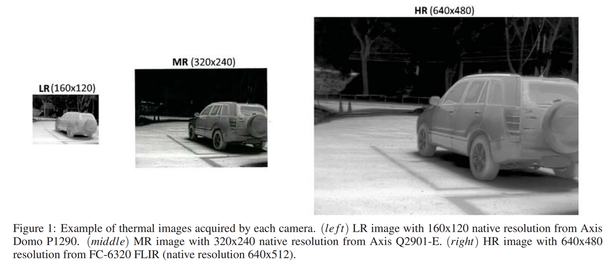

    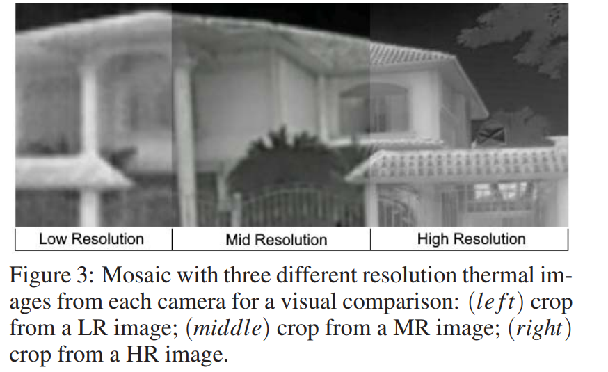
    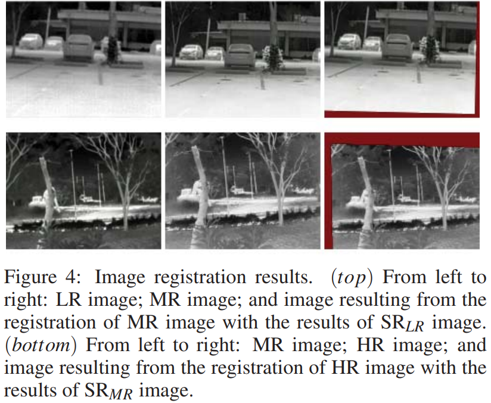

# 🐼Paper

## Thermal Image Enhancement using Convolutional Neural Network

> - https://blog.csdn.net/z243624/article/details/120328561 
> - https://github.dev/ninadakolekar/Thermal-Image-Enhancement 
> - Guided
>
> 热敏相机的选择提供了丰富的温度信息源，受照明变化或背景杂波影响较小。然而，现有的热像仪的分辨率相对小于RGB摄像机，在识别任务中难以充分利用信息。为了缓解这种情况，我们的目标是根据现有方法的广泛分析，增强低分辨率热图像。为此，我们引入了**使用卷积神经网络（CNN）的热图像增强**，称为TEN，它**直接学习从单个低分辨率图像到所需高分辨率图像的端到端映射**。此外，我们检查各种图像域，以找到热增强的最佳代表。总体而言，我们提出了**第一种基于RGB数据的CNN热图像增强方法**。我们提供了大量的实验，旨在评估图像质量和几个目标识别任务的性能，如行人检测、视觉里程计和图像配准。

    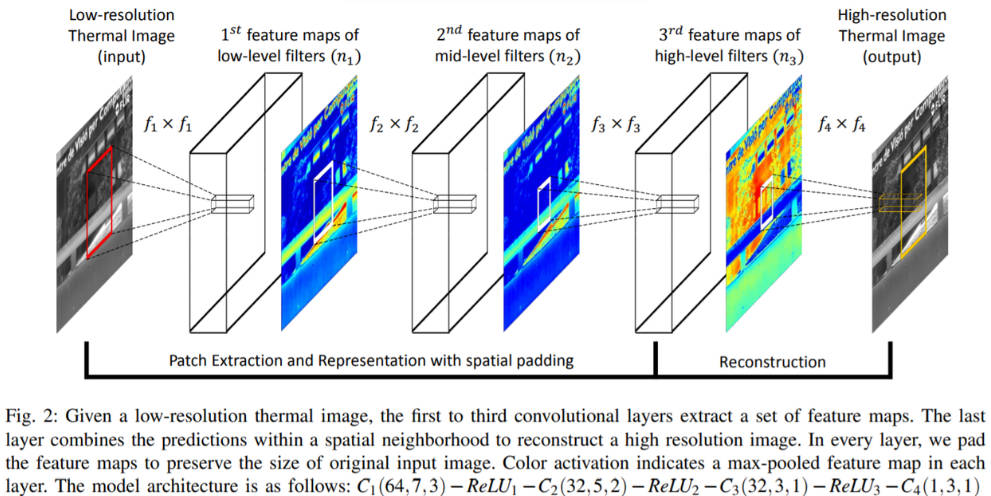

## Infrared image super-resolution using auxiliary convolutional neural

> - https://blog.csdn.net/weixin_42180950/article/details/86661352
> - Guided
>
> 卷积[神经网络](https://so.csdn.net/so/search?q=神经网络&spm=1001.2101.3001.7020)已经成功的应用与可见光图像超分辨率方法。在这篇文章中，我们提出了一种基于CNN的超分辨率算法，使用对应的可见光图片并将该法扩展到弱光条件下的近红外图片中。我们的算法首先从扩展到的低分辨率的近红外图片中提取高频组件，然后将它们作为CNN 的多输入。接下来，CNN输出近红外输入图片的高分辨高频组件。最后，一张高分辨率近红外图片综合了高分辨率高频组件和低分辨率近红外图片。仿真结果显示无论是在质量上还是数量上，提出的方法效果优于最新的方法。

    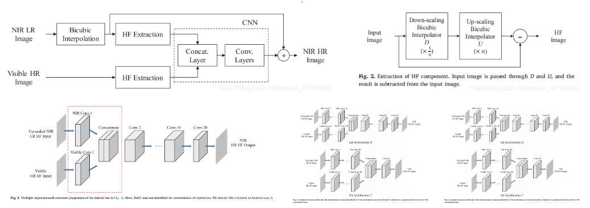

    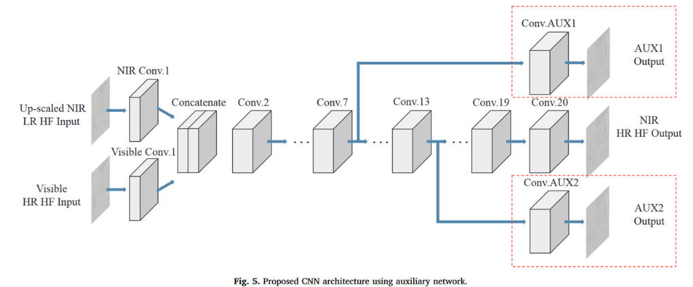

## Cascaded Deep Networks With Multiple Receptive Fields for Infrared Image Super-Resolution

> 我们的方法不是使用单个复杂的深度网络从低分辨率版本重建高分辨率图像，而是在scale×1和×8之间建立一个中点(scale ×2 ),这样丢失的信息可以分成两个分量。每个组件中丢失的信息包含相似的模式，因此即使使用更简单的深层网络也可以更准确地恢复。

    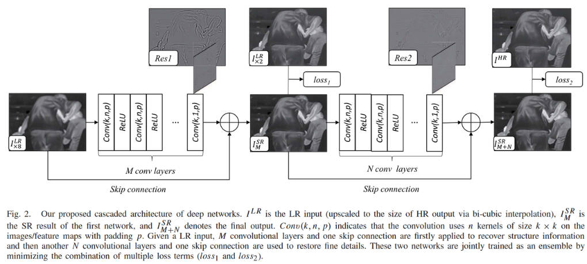

## Research of infrared image super-resolution reconstruction based on improved FSRCNN

> 提出了一种基于快速超分辨率卷积神经网络的多通道红外图像超分辨率重建算法。改进包括两个方面:一是根据红外图像的特点设计了多尺度特征提取通道，丰富了图像重建的细节信息，并引入残差通道提高学习效率；其次，改进激活函数，使其在负区域更具代表性，提高网络性能。

    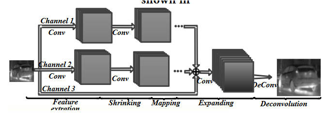

## Deep Networks With Detail Enhancement for Infrared Image Super-Resolution

> 提出了一种新的卷积网络来提高红外图像的空间分辨率。我们的网络能够通过将输入图像分解成低频和高频域来恢复精细细节。在低频域，我们通过深度网络重建图像结构。在高频域，我们重建红外图像细节。此外，我们提出了另一个网络来消除伪像。此外，我们提出了一种新的损失函数，利用可见光图像来增强红外图像的细节。在训练阶段，我们使用可见光图像来指导红外图像恢复；在测试阶段，我们只需要输入红外图像就可以得到超分辨率红外图像。我们使用目标函数优化我们的深度网络，该目标函数使用相应的术语在不同的语义级别惩罚图像。此外，我们建立了一个数据集，其中同一场景上成对的LR-VIS图像由具有红外和可见光传感器的相机捕获，这两个传感器具有相同的光轴。
>
> - Guided
> - 评估指标不是PSNR和SSIM

    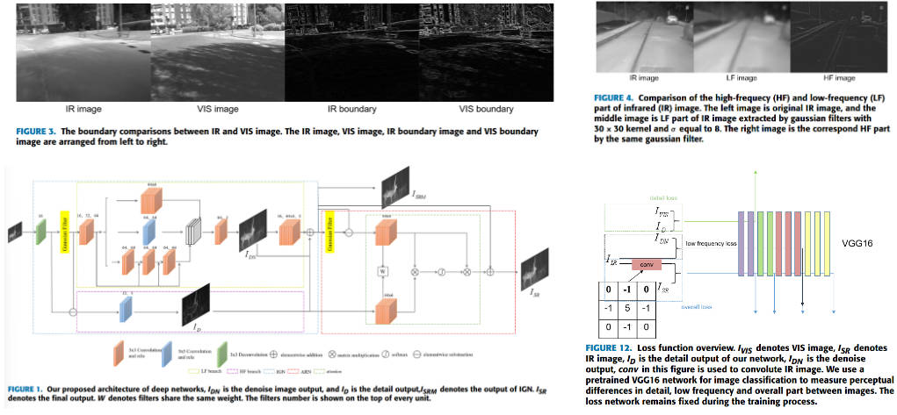

## DDcGAN: A Dual-Discriminator Conditional Generative Adversarial Network for Multi-Resolution Image Fusion

> 本文提出了一种新的端到端模型，称为双鉴别器条件生成对抗网络(DDcGAN ),用于融合不同分辨率的红外和可见光图像。我们的方法建立了一个生成器和两个鉴别器之间的对抗博弈。生成器旨在基于特别设计的内容损失来生成类似真实的融合图像，以欺骗两个鉴别器，而这两个鉴别器旨在除了内容损失之外，还分别区分融合图像和两个源图像之间的结构差异。因此，融合图像被迫同时保留红外图像中的热辐射和可见光图像中的纹理细节。此外，为了融合不同分辨率的源图像，例如低分辨率红外图像和高分辨率可见光图像，我们的DDcGAN约束降采样融合图像具有与红外图像相似的属性。这可以避免导致热辐射信息模糊或可见纹理细节丢失，这在传统方法中通常会发生。此外，我们还将我们的DDcGAN应用于融合不同分辨率的多模态医学图像，例如低分辨率正电子发射断层成像图像和高分辨率磁共振图像
>
> - https://github.com/jiayi-ma/DDcGAN
> - Guided

    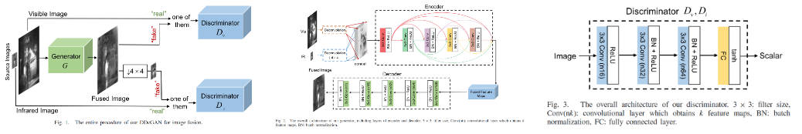

## TherISuRNet: A Computationally Efficient Thermal Image Super-Resolution Network

> 提出了一个超分辨率(SR)的热图像使用深度神经网络架构，我们称之为TherISuRNet。我们在网络中使用具有非对称残差学习的渐进向上扩展策略，该策略对于不同的向上扩展因子(例如×2、×3和×4)在计算上是有效的。所提出的架构包括用于低频和高频特征提取的不同模块以及上采样块
>
> - https://github.dev/Vishal2188/TherISuRNet---A-Computationally-Efficient-Thermal-Image-Super-Resolution-Network

    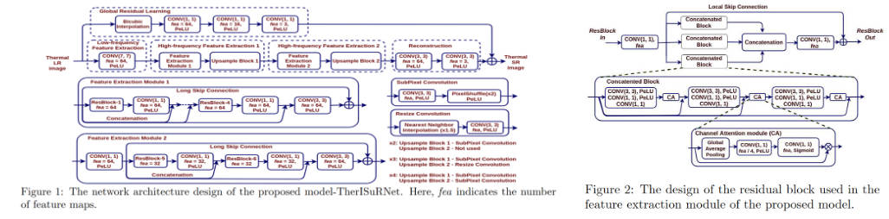

## Pyramidal Edge-maps and Attention-based Guided Thermal Super-resolution

> 由于图像之间的光谱范围不同，使用可见范围图像的热图像的引导超分辨率 (GSR) 具有挑战性。这反过来意味着图像之间的纹理不匹配是显著的，表现为超分辨率热图像中的模糊和鬼影伪影。为了解决这个问题，我们提出了一种基于从可见图像中提取的金字塔边缘图的 GSR 算法。我们提出的网络有两个子网络。第一个子网络超分辨率低分辨率热图像，而第二个子网络在不断增长的感知尺度上从可见图像中获取边缘图，并在基于注意力的融合的帮助下将它们集成到超分辨率子网络中。多级边的提取和集成允许超分辨率网络逐步处理纹理到对象级别的信息，从而能够更直接地识别输入图像之间的重叠边
>
> - https://github.com/honeygupta/PAGSR
> - Guided

    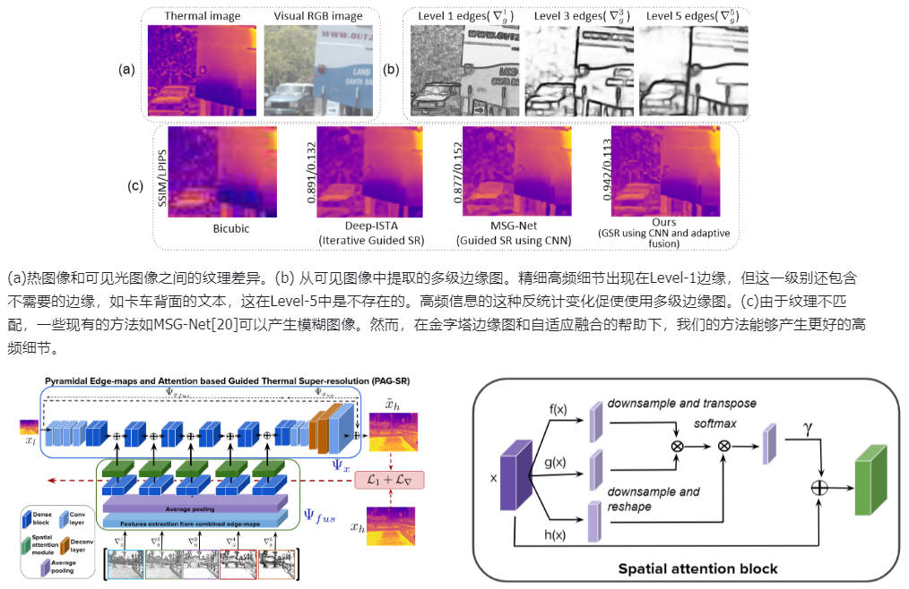

## **Infrared Image Super-Resolution via Heterogeneous Convolutional WGAN**

> 红外图像通常具有较低的分辨率。近年来，深度学习方法主导了图像超分辨率，并在可见图像上取得了显著的性能;然而，红外图像受到的关注较少。红外图像的模式较少，因此深度神经网络很难从红外图像中学习到不同的特征。在本文中，我们提出了一个采用异构卷积和对抗训练的框架，即基于异构核的超分辨率Wasserstein GAN (HetSRWGAN)，用于红外图像的超分辨率。HetSRWGAN算法是一种轻量级GAN架构，采用即插即用异构核残差块。此外，采用了一种利用图像梯度的新型损失函数，可以应用于任意模型
>
> - ❓ The infrared images in the dataset are RGB images, which are three-channel images 

    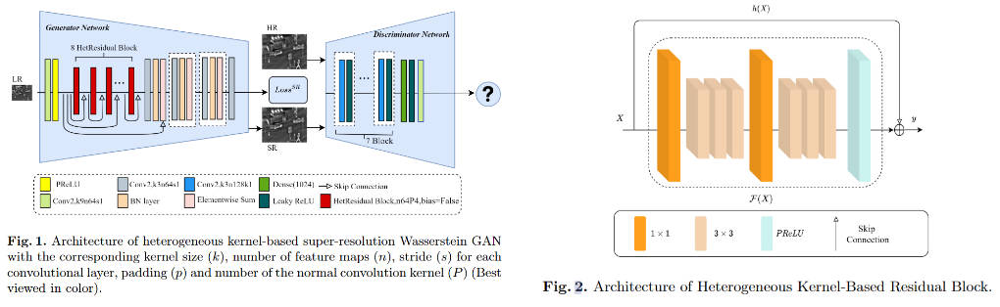

## Super-resolution reconstruction of infrared images based on a convolutional neural network with skip connections

> 提出了一种基于跳跃连接卷积神经网络的红外图像超分辨率重建方法。全局残差学习和局部残差学习的引入降低了计算复杂度，加快了网络收敛。多重卷积层和反卷积层分别实现红外图像特征的提取和恢复。跳过连接和通道融合被引入到网络中，以增加特征图的数量并促进反卷积层来恢复图像细节。与其他红外信息恢复方法相比，该方法在获取高分辨率细节方面具有明显优势。

    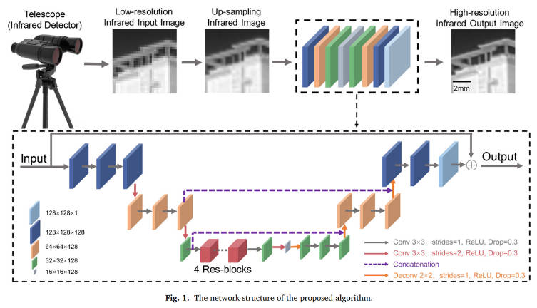

## Multi-Scale Ensemble Learning for Thermal Image Enhancement

> 在这项研究中，我们提出了一种基于卷积神经网络的多尺度集成学习方法，用于不同图像尺度条件下的热图像增强。整合多个尺度的热图像一直是一个棘手的任务，因此方法已经单独训练和评估每个尺度。然而，这导致了网络在特定规模上正常运行的限制。为了解决这个问题，引入了一种利用多比例尺置信度图的新型并行架构来训练一个在不同比例尺条件下运行良好的网络

    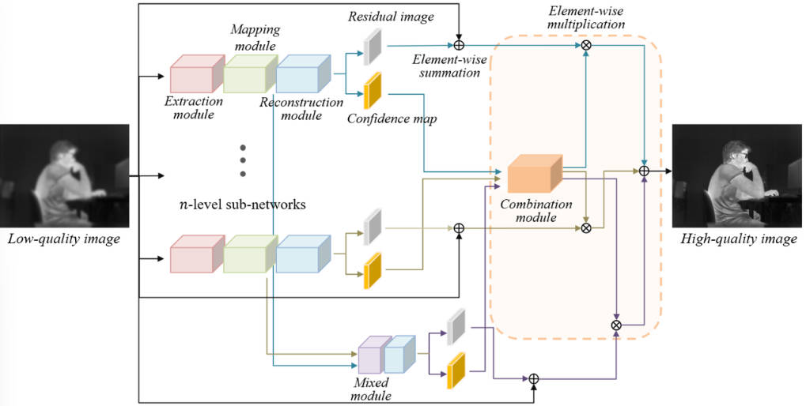

## Joint image fusion and super-resolution for enhanced visualization via semi-coupled discriminative dictionary learning and advantage embedding

> 图像融合与超分辨率联合的研究很少，现有方法的性能与简单图像融合的性能相差甚远。为了解决这一问题，我们提出了一种基于判别字典学习的联合融合超分辨率框架。具体来说，我们首先共同学习两对低秩稀疏字典(LRSD)和一个转换字典。其中一对用于表示低分辨率输入图像的低秩稀疏分量，另一对用于重建高分辨率融合结果;利用转换字典建立低分辨率图像和高分辨率图像编码系数之间的关系。为了弥补细节的丢失，还学习了结构信息补偿字典(SICD)，并用SICD对丢失的信息进行补偿，从而增强了最终结果的可视化。为了将优秀图像融合方法的优点融合到融合重建结果中，提出了一种基于反卷积的优势嵌入方案

    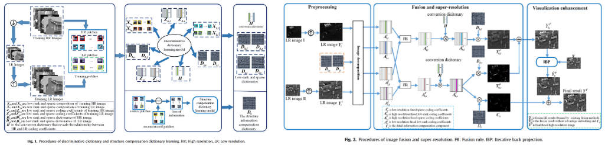

## Infrared Image Super-Resolution via Transfer Learning and PSRGAN

> 单幅图像超分辨率(SISR)的最新进展证明了深度学习在实现更好性能方面的力量。由于红外图像超分辨率的训练数据的重新收集和模型的重新训练是昂贵的，只有少量的样本用于恢复红外图像是SISR领域的一个重要挑战。为了解决这一问题，我们首先提出了渐进式超分辨率生成对抗网络(PSRGAN)，该网络包含主路径和分支路径。采用深度残差块(DWRB)表示主路径红外图像的特征。然后，利用新型浅分量蒸馏残差块(SLDRB)提取其他路径下的可见光图像特征;此外，受迁移学习的启发，我们提出了多阶段迁移学习策略，用于弥合不同高维特征空间之间的差距，从而提高PSGAN的性能
>
> - https://github.com/yongsongH/Infrared_Image_SR_PSRGAN
> - Guided，非配对
> - 红外训练 → 可见光训练 → 红外训练

    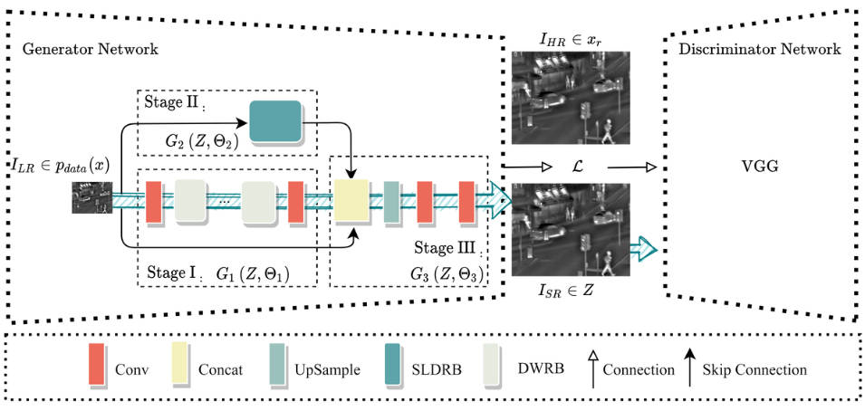

## Channel Split Convolutional Neural Network (ChaSNet) for Thermal Image Super-Resolution

> 本文介绍了一种基于信道分裂的卷积神经网络(ChasNet)用于热图像SR，以消除网络中的冗余特征。利用通道分割从低分辨率(LR)热图像中提取通用特征，有助于保留SR图像中的高频细节。我们演示了在PBVS-2021热SR挑战赛组织的两种不同场景中提出的SR任务网络的适用性，包括噪声消除(Track-1)和域转移(Track-2)
>
> - https://github.com/kalpeshjp89/ChasNet
> - Guided，跨域，都在红外域

    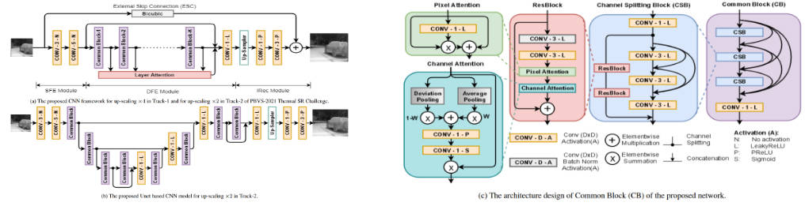

## Real-World Thermal Image Super-Resolution

> 真实世界超分辨率(RWSR)是一个可以用来解决这个问题的主题，它使用图像处理技术，通过重建丢失的高频信息来增强真实世界图像的质量。这项工作采用了现有的RWSR框架，旨在超分辨率真实世界的RGB图像。该框架估计生成真实的低分辨率(LR)和高分辨率(HR)图像对所需的退化参数，然后SR模型使用构建的图像对学习LR和HR域之间的映射，并将该映射应用于新的LR热图像

## Toward Unaligned Guided Thermal Super-Resolution

> 许多热像仪都配有一个高分辨率的可见范围相机，它可以作为超分辨低分辨率热图像的指南。然而，热图像和可见光图像形成立体对，并且它们的光谱范围的差异使得这两个图像的像素对齐非常具有挑战性。现有的引导超分辨率(GSR)方法是基于对齐的图像对，因此不适合这项任务。在本文中，我们试图通过提出两个模型来消除GSR的像素-像素对准的必要性：第一个模型采用基于相关性的特征对准损失来减少特征空间本身的失准，第二个模型包括失准图估计块作为端到端框架的一部分，该框架充分对准输入图像以执行引导的超分辨率
>
> - https://github.com/honeygupta/UGSR
> - Guided，红外-可见光

    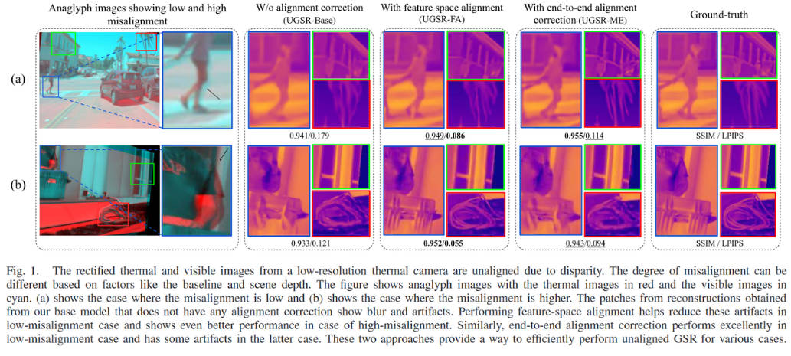

    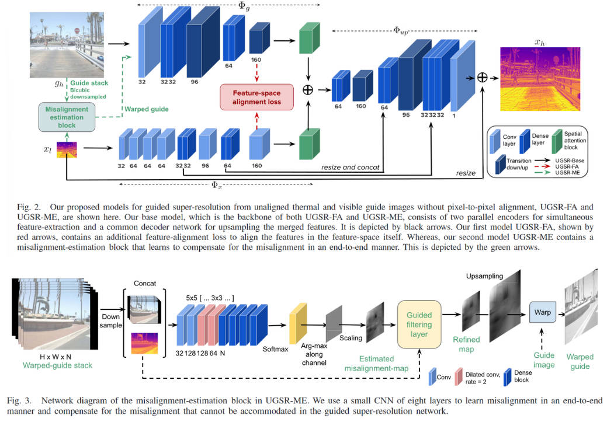

## Heterogeneous Knowledge Distillation for Simultaneous Infrared-Visible Image Fusion and Super-Resolution

> 有些方法可以同时实现低分辨率图像的融合和超分辨率，但由于缺乏高分辨率融合结果的指导，融合性能的提高是有限的。针对这一问题，提出一种具有多层注意力嵌入的异构知识提取网络(HKDnet)来实现红外和可见光图像的融合和超分辨率。准确地说，所提出的方法由高分辨率图像融合网络(教师网络)和低分辨率图像融合和超分辨率网络(学生网络)组成。教师网主要融合高分辨率输入图像，引导学生网获得融合和超分辨率联合实施的能力。为了使学生网更加关注可视输入图像的纹理细节，我们设计了一种角点嵌入关注机制。该机制集成了通道注意、位置注意和角落注意，以突出可见图像的边缘、纹理和结构。对于输入的红外图像，通过挖掘层间特征的关系来构造双频注意，以突出红外图像的显著目标在融合结果中的作用
>
> - https://github.com/firewaterfire/HKDnet 
> - https://blog.csdn.net/weixin_43690932/article/details/127947851
> - Guided，多任务

    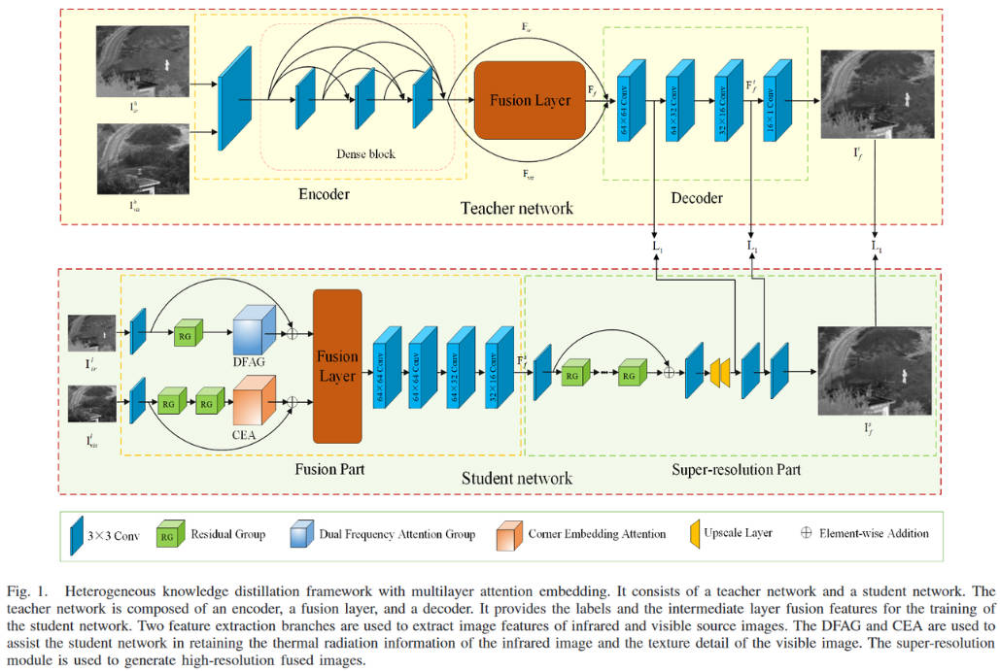

    

## Super-resolution reconstruction of thermal imaging of power equipment based on Generative Adversarial Network with Channel Filtering

> 本文通过构建具有通道滤波的生成式对抗网络，实现了电力设备热成像的增强。该网络在SRGAN(超分辨率生成对抗网络)的生成器部分嵌入了阈值过滤模块，利用信道信息进行自主阈值学习。滤波在降低图像噪声的基础上提高了训练的稳定性；同时，通过边缘提取技术加强图像的峰值信息，提高网络恢复图像边缘的能力。

    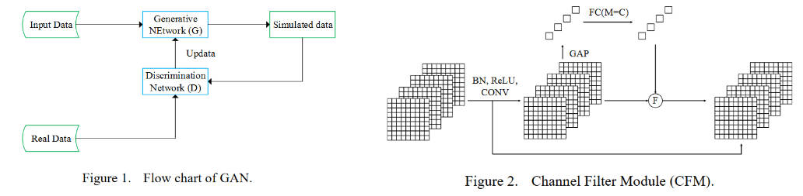

## A Novel Domain Transfer-Based Approach for Unsupervised Thermal Image Super-Resolution

> 本文提出了一种转移域策略来解决低分辨率热传感器的局限性，并生成合理质量的较高分辨率图像。所提出的技术采用CycleGAN架构，并使用ResNet作为生成器中的编码器，以及注意模块和新颖的损失函数。在用三个不同的热传感器获得的多分辨率热图像数据集上训练该网络。结果显示，在第二届CVPR-PBVS-2021热成像超分辨率挑战赛上，性能基准测试结果优于最先进的方法

    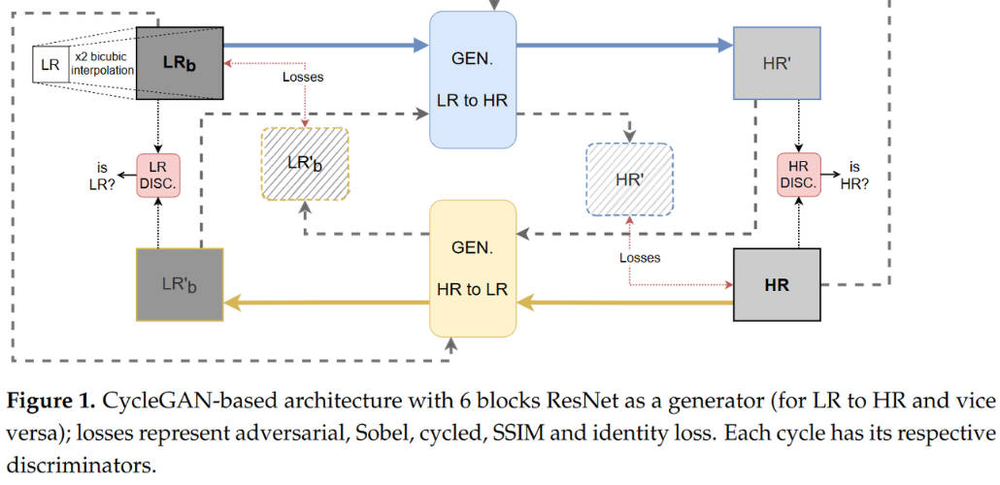

## Single Infrared Image Super-Resolution with Lightweight Self-corrected Attention Network

> 提出了一种基于深度学习的红外成像系统单幅图像超分辨率(SISR)方法。我们构造了一个自校正注意网络(SCANet)来从低分辨率(LR)图像重建目标的高分辨率(HR)红外图像。具体来说，我们设计了一个自校正注意块(SCAB ),它以递归和反馈的方式将上采样和下采样操作与注意模块相结合。通过SCAB，我们用红外图像训练了一个端到端的网络，实现了参数和计算量的减少。大量实验验证了该方法的有效性。结果表明，SCANet可以利用多个放大因子(如x 2、x 3和x 4)实现单幅红外图像的超分辨率

    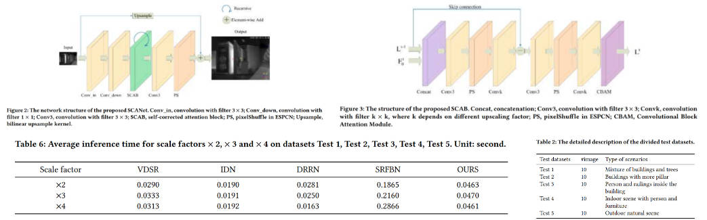

## Infrared Image Super-Resolution via Generative Adversarial Network with Gradient Penalty Loss

> 红外热成像技术已逐步发展并广泛应用于测量和无损检测领域。然而，低对比度模糊细节和昂贵的采集设备仍然是其进一步实际应用和广泛采用的障碍。本文提出了一个包含深度学习技术的新框架，为红外图像超分辨率提供了一个相对有竞争力和兼容性的解决方案。首先，利用Wasserstein距离，通过生成式对抗网络(GAN)检测低分辨率图像的辐射信息，并自动转换到高分辨率图像。其次，鉴别器利用梯度罚损失函数来引导生成器达到合理且可接受的收敛。通过对三个广泛使用的红外数据集的评估，所提出的方法表现出优于现有方法的性能，分别具有更精确的峰值信噪比(PSNR)和结构相似性指数度量(SSIM)

    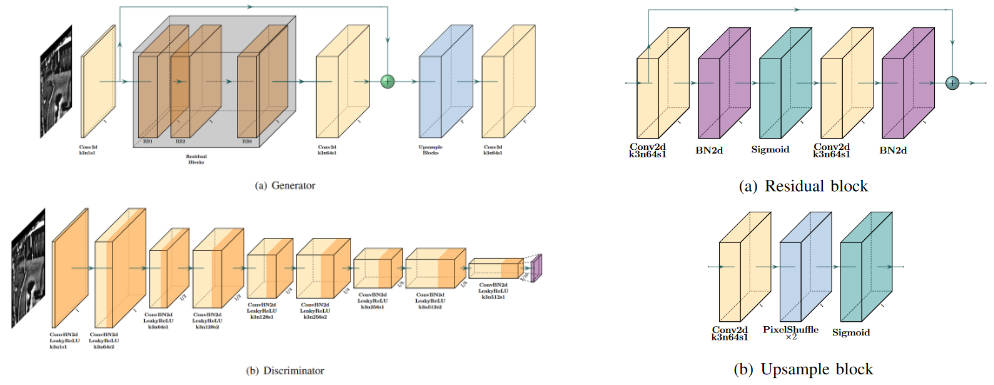

## CIPPSRNet: A Camera Internal Parameters Perception Network Based Contrastive Learning for Thermal Image Super-Resolution

> 当前的研究没有为多传感器数据训练提供有效的解决方案，这可能是由像素失配和简单的退化设置问题驱动的。提出了一种用于红外热像增强的摄像机内部参数感知网络。相机内部参数(CIP)被显式建模为特征表示，LR特征通过感知CIP表示被转换到包含内部参数信息的中间域。通过CIPPSRNet学习HR特征的中间域和空间域之间的映射。此外，我们引入**对比学习**来优化预先训练好的摄像机内部参数表示网络和特征编码器。我们提出的网络能够实现从LR到HR域的更有效的转换。此外，使用对比学习可以提高网络对像素匹配不充分的未对准数据的适应性及其鲁棒性。在PBVS2022 TISR数据集上的实验表明，我们的网络在热随机共振任务上取得了最先进的性能。
>
> - Guided

    

    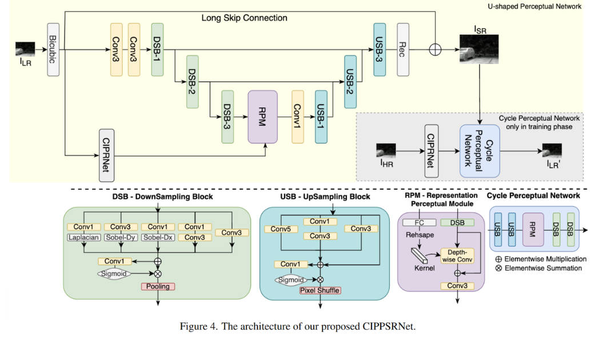

## Multimodal super-resolution reconstruction of infrared and visible images via deep learning

> 图像融合任务被转化为保持红外-可见光图像的结构和强度比的问题。设计了相应的损失函数来扩大热目标和背景之间的权重差。此外，针对传统网络映射函数不适用于自然场景的问题，引入了基于回归网络的单幅图像超分辨率重建。正向生成和反向回归模型被认为是通过双重映射约束来减少无关函数映射空间和逼近理想场景数据

    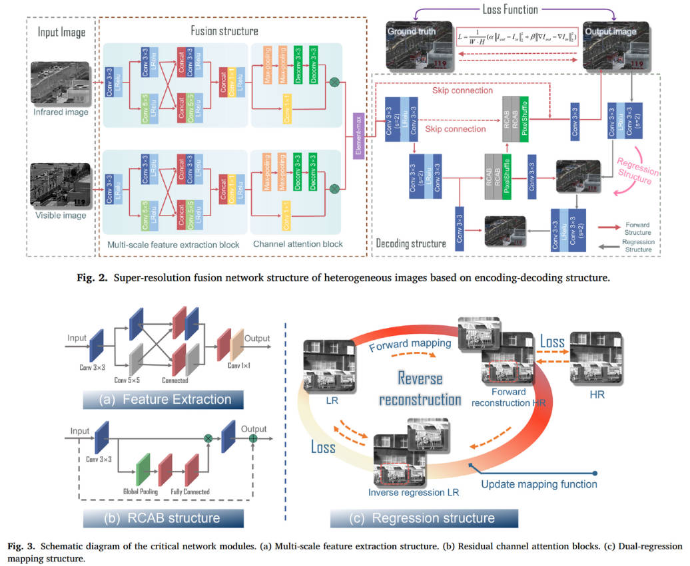

## Edge-Focus Thermal Image Super-Resolution using Generative Adversarial Network

> 提出了一种利用高分辨率可见光图像的边缘特征来提高热图像分辨率的方法。Canny边缘检测和细线降尺度算法用于从高分辨率可见光图像生成边缘图，以有助于超分辨率网络。所提出的超分辨率模型是基于生成式对抗网络架构设计的，用于×2、×3和×4放大。KAIST数据集用于训练和测试模型。峰值信噪比(PSNR)和结构相似性指数(SSIM)用于评价超分辨率图像的质量。在训练过程之后，为了证明边缘特征的有效性，我们将提出的方法与其他方法生成的超分辨率图像的质量进行了比较
>
> - Guided

    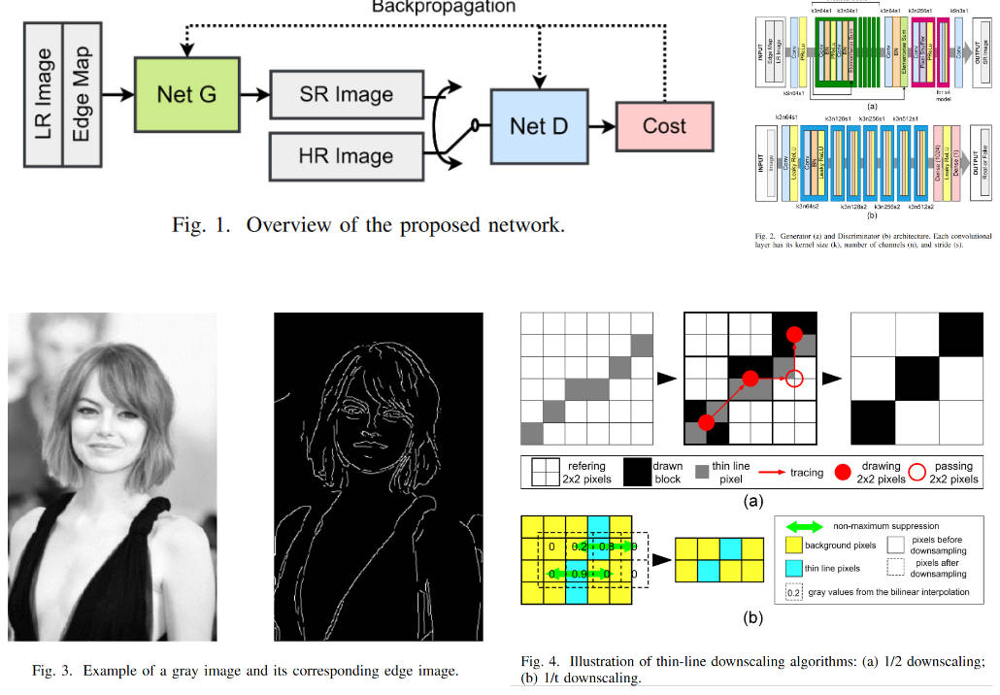

## Meta transfer learning-based super-resolution infrared imaging

> 提出了一种基于元迁移学习和轻量级网络的红外图像超分辨率方法。我们设计了一个轻量级网络来学习低分辨率和高分辨率红外图像之间的映射。我们用外部数据集训练网络，用内部数据集使用元迁移学习，使网络下降到一个敏感和可转移的点。我们建立了一个带有红外模块的红外成像系统。设计的网络在个人计算机上实现，并且通过训练的网络重建SR图像。本文的主要贡献在于采用了一种轻量级网络和元迁移学习方法，获得了视觉效果更好的红外超分辨率图像。数值和实验结果表明，该方法实现了红外图像的超分辨率，其性能优于四种现有的图像超分辨率方法。该方法在移动红外设备图像超分辨率中具有实际应用价值

    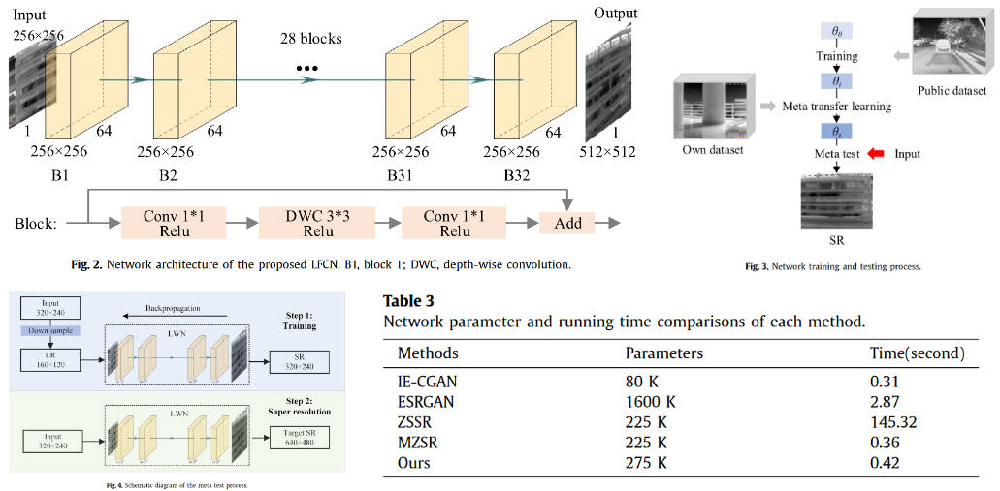

## Thermal Image Super‐Resolution Methods Using Neural Networks

> 热成像技术已经在许多领域得到普及。由于人眼无法看到热光谱，并且光线较弱，热图像分析已经成为医学、制造业、建筑业和其他行业不可或缺的一部分。大多数热像仪在分析物体温度时会产生低分辨率图像，这使得分析原始温谱图的过程变得复杂。因此，提高热图像质量的问题在今天是相关的。随着人工智能和深度学习技术的发展，新的超分辨率方法不断涌现。这种方法也可以适用于热成像处理。这项工作考察了现代超分辨率方法在热视觉领域的性能

    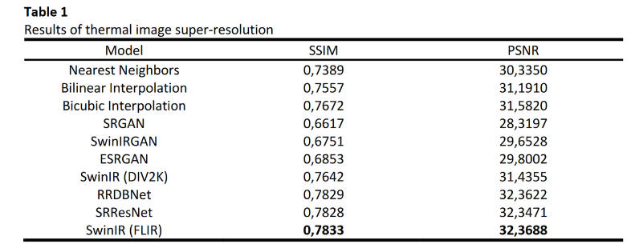

## Thermal UAV Image Super-Resolution Guided by Multiple Visible Cues

> 在本文中，我们提出了一种新的多条件引导网络(MGNet)来有效地挖掘热无人机图像SR的可见光图像信息。高分辨率的可见光无人机图像通常包含显著的外观、语义和边缘信息，这些信息在提高热无人机图像SR的性能方面起着关键作用。因此，我们设计了一种有效的多条件引导模块(MGM)来利用可见光图像的外观、边缘和语义线索来引导热无人机图像SR。此外，我们为可见光图像引导的热无人机图像SR任务建立了第一个基准数据集。它由多模态无人机平台收集，由1025对手动对齐的可见光和热图像组成。在建立的数据集上的大量实验表明，我们的MGNet可以有效地利用来自可见光图像的有用信息来提高热无人机图像SR的性能，并且与几种最先进的方法相比表现良好
>
> - Guided

    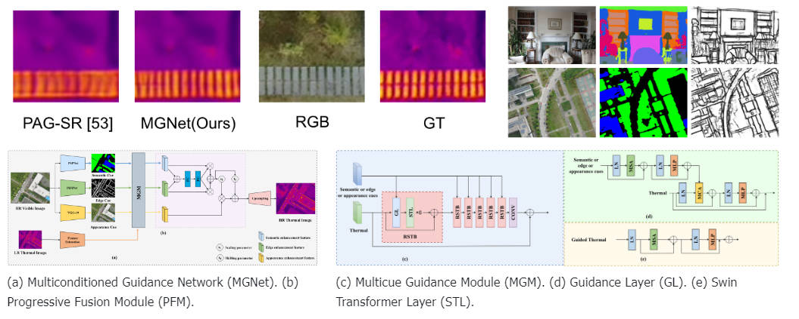

## Infrared image super-resolution method based on dual-branch deep neural network

> 红外图像比可见光图像分辨率低、对比度低、细节少，这导致其超分辨率处理比可见光图像更困难。提出了一种基于深度神经网络的方法，该网络包括图像超分辨率分支和梯度超分辨率分支，用于从单帧红外图像重建高质量超分辨率图像。图像SR分支使用类似于增强SR生成对抗网络(ESRGAN)的基本结构从初始低分辨率红外图像重建SR图像。梯度SR分支去除模糊，提取梯度图，并重建SR梯度图。为了获得更自然的超分辨率图像，在这些分支之间采用了基于注意机制的融合块。为了保持几何结构，定义并增加了梯度L1损耗和梯度GAN损耗

    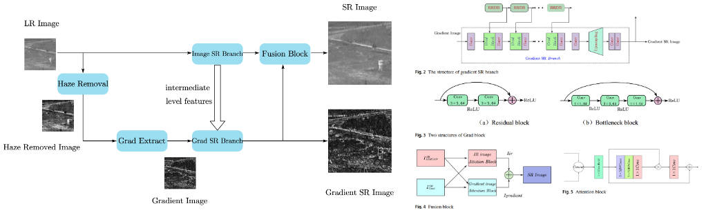

## Improved Thermal Infrared Image Super-Resolution Reconstruction Method Base on Multimodal Sensor Fusion

> 提出了一种基于多模态传感器融合的热红外图像超分辨率重建方法，旨在提高热红外图像的分辨率，依靠多模态传感器信息重建图像中的高频细节，从而克服了成像机制的局限性。首先，我们设计了一种新的超分辨率重建网络，该网络由主特征编码、超分辨率重建和高频细节融合子网络组成，以增强热红外图像的分辨率，依靠多模态传感器信息来重建图像中的高频细节，从而克服了成像机制的局限性。我们设计了分层扩张蒸馏模块和交叉注意转换模块来提取和传输图像特征，增强了网络表达复杂模式的能力。然后，我们提出了一种混合损失函数来指导网络从热红外图像和参考图像中提取显著特征，同时保持准确的热信息。最后，我们提出了一种**学习策略**，以确保网络的高质量超分辨率重建性能，即使在没有参考图像的情况下
>
> - Guided

    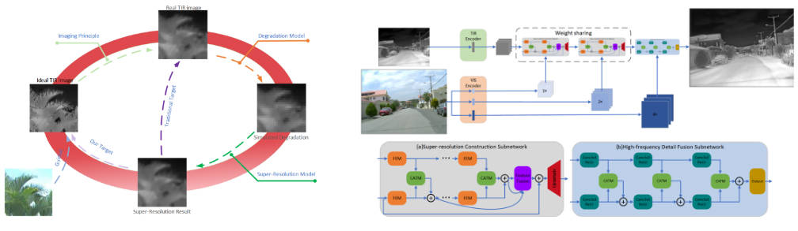

## CoReFusion: Contrastive Regularized Fusion for Guided Thermal Super-Resolution

> 提出了一种新的数据融合框架和正则化技术，用于引导热图像的超分辨率。所提出的架构在计算上是廉价的和轻量的，尽管丢失了模态之一，即高分辨率RGB图像或较低分辨率热图像，也能够保持性能，并且被设计为在存在丢失数据的情况下是鲁棒的。
>
> - https://github.com/Kasliwal17/CoReFusion
> - Guided

    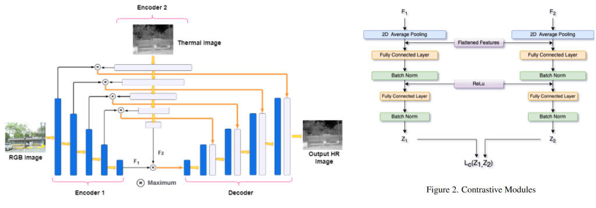

## MULTI-SPECTRAL SUPER-RESOLUTION OF THERMAL INFRARED DATA PRODUCTS FOR URBAN HEAT APPLICATIONS

> 我们在城市热分析的背景下，在两个多光谱数据集上评估了基于深度学习的单图像超分辨率(SISR)的最新发展。数据集的目标分别是地表温度(LST)产品和大气顶部(TOA) LWIR辐射。在此过程中，我们展示了生成建模方法的潜力，特别是超分辨率生成对抗网络(SRGAN)，以提高热数据产品的空间分辨率。我们用来自可见光谱的额外波段扩展了原始SRGAN模型，以将空间分辨率提高到四倍，并估计模型的**预测不确定**性。与双三次上采样相比，这种多光谱超分辨率(MSSR)方法将峰值信噪比(PSNR)提高了3dB至6dB
>
> - Guided

    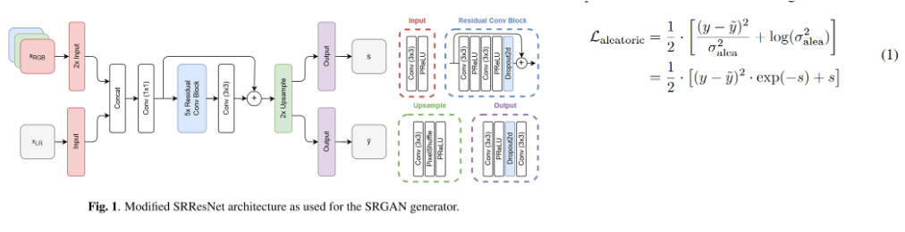

## Thermal image super-resolution via multi-path residual attention network

> 现有深度SR方法的性能受到单个小卷积核(例如，3 × 3)的狭窄感受野的限制。本文提出了一种结合多径残差和注意块的热成像SISR深度网络MPRANet。具体而言，创新设计的多路径残差块由不同大小的卷积核构成的并行深度方向可分离卷积路径构成，用于提取局部微小和全局大特征，有效增强MPRANet的容量。同时，注意块由通道注意和空间注意模块级联而成，以在通道和空间维度上顺序地重新缩放特征。提出了一种在不增加计算负担的情况下提高MPRANet性能的混合数据增强(MoDA)策略。MoDA充分利用多种像素域数据增强方法来提高MPRANet的泛化能力

    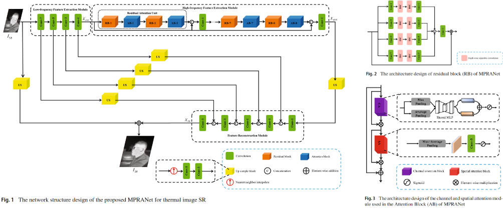

## SRDRN-IR: A Super Resolution Deep Residual Neural Network for IR Images

> 针对红外图像的超分辨率问题，提出了一种深度神经网络结构SRDRN。SRDRN使用具有残差学习的通道分裂概念来实现计算高效的超分辨率。通过用可用的热图像数据集进行分析，验证了所提出的设计的可行性。

    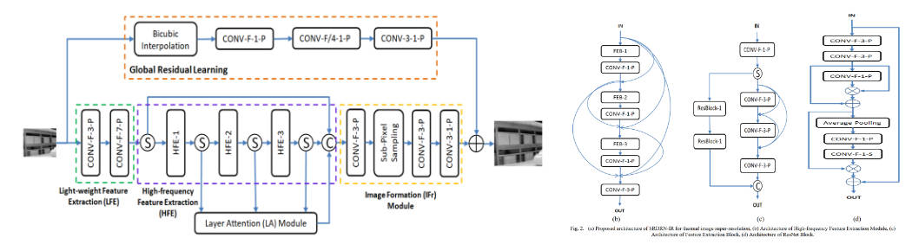

## Super-Resolution Infrared Imaging via Degraded Information Distillation Network

> 提出了一种退化信息提取网络的无监督超分辨率红外成像方法。我们设计了一个渐进提取退化信息的网络模型，以学习更多具有鉴别特征的退化信息。我们使用双注意卷积来实现通道和空间的特征自适应。我们使用亚像素卷积来实现红外图像的重建。我们使用红外图像训练我们的模型，并系统地评估所提出的方法

    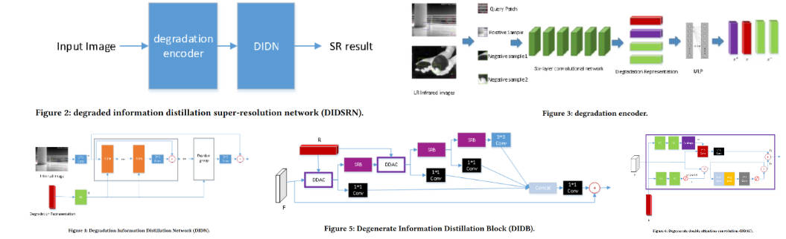

## Real-infraredSR: real-world infrared image super-resolution via thermal imager

> 现有的大多数超分辨率方法使用双三次插值得到的合成数据在真实世界场景中获得的重建性能并不令人满意。为了解决这一问题，本文创新性地提出了一种基于制冷热探测器和红外变焦镜头的不同分辨率的红外真实数据集，使网络能够获取更真实的细节。通过调节红外变焦镜头获得不同视场下的图像，进而实现高低分辨率(HR-LR)图像的尺度和亮度对齐。该数据集可用于红外图像超分辨率，上采样尺度为2。为了有效地学习红外图像的复杂特征，提出了一种非对称残差块结构，有效地减少了参数数量，提高了网络性能。最后，为了解决预处理阶段的轻微错位问题，引入了上下文损失和感知损失来提高视觉性能

    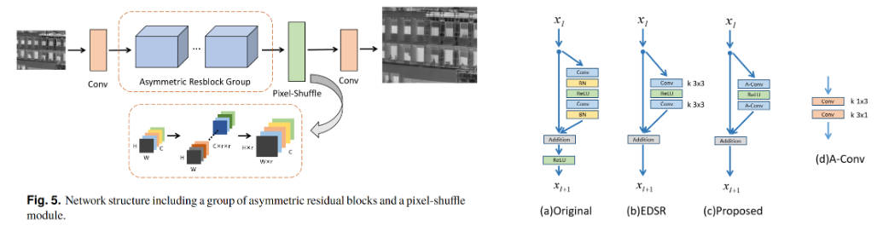

## CMRFusion: A cross-domain multi-resolution fusion method for infrared and visible image fusion

> 提出了一种基于自动编码网络和跨域注意力融合策略的跨域多分辨率红外与可见光图像融合方法CMRFusion。采用自动编码网络，用编码网络提取深层多尺度特征，用解码网络重建图像。采用跨域注意力融合策略来促进来自源图像之一的纹理细节的保持。该方法首先通过简单的双三次策略对低分辨率红外图像进行放大，以匹配源图像的分辨率。然后，采用编码网络从红外和可见光图像中提取特征。以提取的红外图像特征为基础，通过跨域注意力融合策略，补充可见光图像提取特征中的细节，得到融合特征，利用第一解码网络重构高分辨率红外图像。最后，采用编码网络从可见光和重建的红外图像中提取特征。以可见光图像的提取特征为基础，通过跨域注意力融合策略，从重构的高分辨率红外图像中补充提取特征中的细节，得到融合特征，用第二解码器网络重构融合结果

    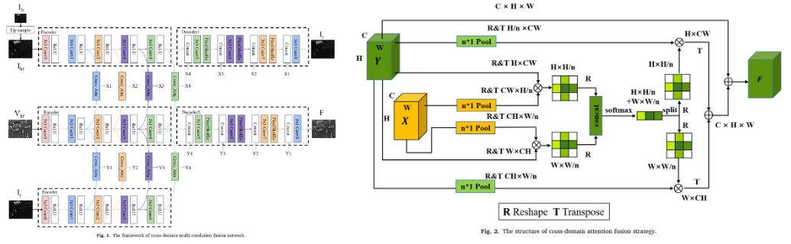

